  
  

<picture>
  <source media="(prefers-color-scheme: dark)" srcset="dark.svg">
  <source media="(prefers-color-scheme: light)" srcset="light.svg">
  
</picture>

 

### 🔭 Şu An Üzerinde Çalıştıklarım

<picture>
  <source media="(prefers-color-scheme: dark)" srcset="working-on-dark.svg">
  <source media="(prefers-color-scheme: light)" srcset="working-on-light.svg">
  
</picture>

 

### 🧬 Dil Dağılımı

<picture>
  <source media="(prefers-color-scheme: dark)" srcset="langs-dark.svg">
  <source media="(prefers-color-scheme: light)" srcset="langs-light.svg">
  
</picture>

 

### 📡 Canlı Aktivite

<picture>
  <source media="(prefers-color-scheme: dark)" srcset="activity-dark.svg">
  <source media="(prefers-color-scheme: light)" srcset="activity-light.svg">
  
</picture>

  

 

### 📊 GitHub İstatistiklerim

  <picture>
    <source media="(prefers-color-scheme: dark)" srcset="https://github-readme-stats.vercel.app/api?username=vdnp&show_icons=true&theme=dracula&hide_border=true&bg_color=0d1117" />
    <source media="(prefers-color-scheme: light)" srcset="https://github-readme-stats.vercel.app/api?username=vdnp&show_icons=true&theme=gruvbox_light&hide_border=true" />
    
  </picture>
  <picture>
    <source media="(prefers-color-scheme: dark)" srcset="https://github-readme-streak-stats.herokuapp.com/?user=vdnp&theme=dracula&hide_border=true&background=0d1117" />
    <source media="(prefers-color-scheme: light)" srcset="https://github-readme-streak-stats.herokuapp.com/?user=vdnp&theme=gruvbox-light&hide_border=true" />
    
  </picture>

  <picture>
    <source media="(prefers-color-scheme: dark)" srcset="https://github-readme-activity-graph.vercel.app/graph?username=vdnp&theme=dracula&hide_border=true&bg_color=0d1117" />
    <source media="(prefers-color-scheme: light)" srcset="https://github-readme-activity-graph.vercel.app/graph?username=vdnp&theme=juicy-fresh&hide_border=true" />
    
  </picture>

 

### 🤝 Bana Ulaşın

  
  
  

 

### 🐍 Contribution Snake

  

